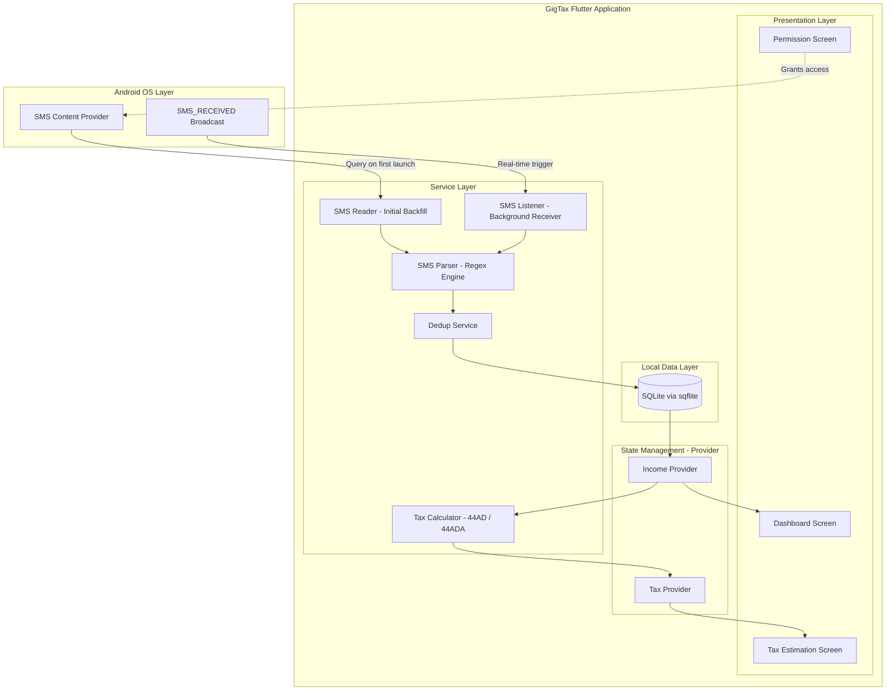
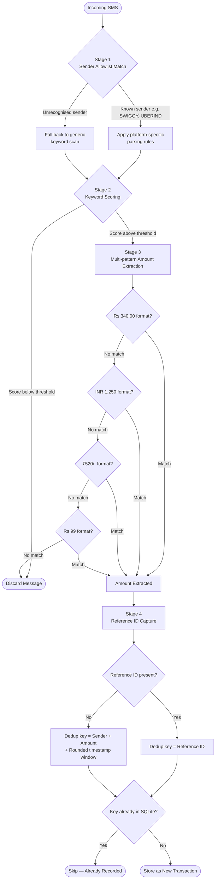
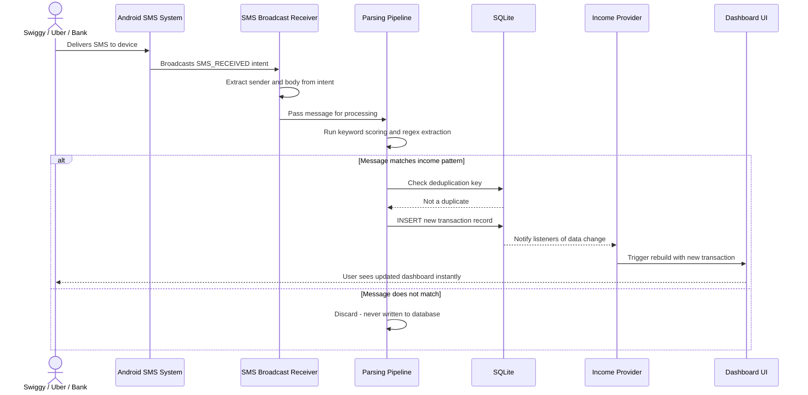
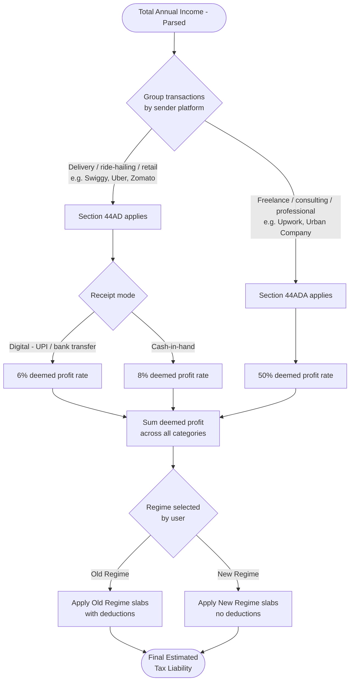

# GigTax !

> SMS-powered income tracker and tax estimator for gig workers — turns your phone's SMS inbox into a structured, tax-ready income ledger using on-device parsing, with zero manual entry and zero data leaving the device.

---

[](LICENSE)
[](https://flutter.dev/)
[](https://dart.dev/)
[](https://developer.android.com/)
[](https://www.sqlite.org/)
[]()
[]()
[]()

---

## Table of Contents

- [The Problem](#the-problem)
- [The Solution](#the-solution)
- [Why On-Device Parsing](#why-on-device-parsing)
- [System Architecture](#system-architecture)
- [Parsing Pipeline](#parsing-pipeline)
- [Background SMS Capture Flow](#background-sms-capture-flow)
- [Data Model](#data-model)
- [Features](#features)
- [Tax Estimation — ITR-4](#tax-estimation--itr-4)
- [Tax Decision Logic](#tax-decision-logic)
- [Tech Stack](#tech-stack)
- [Project Structure](#project-structure)
- [Prerequisites](#prerequisites)
- [Installation](#installation)
- [Testing SMS Parsing on an Emulator](#testing-sms-parsing-on-an-emulator)
- [Permissions](#permissions)
- [Security and Privacy Model](#security-and-privacy-model)
- [Demo Flow](#demo-flow)
- [Known Limitations](#known-limitations)
- [Frequently Asked Questions](#frequently-asked-questions)
- [Roadmap](#roadmap)
- [Contributing](#contributing)
- [License](#license)

---

## The Problem

India has approximately 15 million gig workers across platforms like Swiggy, Uber, Zomato, Urban Company, and Upwork. They face a financial problem that no existing product solves:

| Pain Point | Reality |
|---|---|
| Fragmented income | Earnings split across 3 to 7 platforms with no unified view |
| No paper trail | Income is buried in SMS inboxes, not structured ledgers |
| Tax confusion | Most gig workers don't know they qualify for ITR-4 presumptive taxation |
| Signal vs. noise | Income SMSes are mixed in with OTPs, promotional offers, and personal bank credits |
| Compliance risk | Under-reporting or non-filing due to lack of visibility into actual annual earnings |
| Accountant cost | Professional tax help often costs more than the tax actually owed under presumptive schemes |

GigTax addresses this directly from the SMS inbox, automatically, with no manual data entry and no recurring cost.

---

## The Solution

GigTax reads SMS messages locally on-device, filters income-related transactions, and converts raw text into a structured financial dashboard with live ITR-4 tax estimation.

```
SMS Inbox  ->  Keyword and Pattern Filter  ->  Structured Income Ledger  ->  Tax Estimate
```

No manual entry. No bank account integration required. No data ever leaves the device.

---

## Why On-Device Parsing

Most fintech apps solve the "fragmented income" problem by asking users to connect their bank account through an aggregator (Account Aggregator framework, screen-scraping, or OAuth-based bank linking). GigTax deliberately avoids this for three reasons:

1. **Trust friction** — gig workers are often wary of linking bank credentials to a third-party app, especially an early-stage one with no institutional backing
2. **Coverage gaps** — many gig payouts settle into UPI handles or wallets before reaching a bank account, and aggregator APIs do not always capture every leg of that journey
3. **Latency** — SMS notifications arrive the instant a payout settles; bank statement APIs often lag by hours or days, and many are pull-based rather than push-based

SMS is the one channel every Indian gig worker already has, already trusts, and that updates in real time without any integration cost.

---

## System Architecture

The high-level component view of GigTax — everything runs on-device, with no backend service in the data path.



---

## Parsing Pipeline

How a single raw SMS becomes a validated, deduplicated transaction record. Four progressively narrower stages run on every candidate message.



---

## Background SMS Capture Flow

What happens after the initial inbox scan, when the app is idle or backgrounded and a new income SMS arrives.



---

## Data Model

```
Transaction
├── id                  TEXT PRIMARY KEY
├── senderId            TEXT        e.g. "SWIGGY", "UBERIND"
├── amount               REAL        parsed rupee value
├── rawMessage           TEXT        original SMS body, stored for audit
├── timestamp            INTEGER     epoch millis of SMS receipt
├── referenceId          TEXT NULL   bank/platform reference if present
├── category             TEXT        "business" | "professional" | "uncategorised"
├── source               TEXT        "platform" | "bank" | "unknown"
└── isDuplicateOf        TEXT NULL   self-referential FK if flagged as duplicate
```

All fields are stored exclusively in the local SQLite database. There is no remote schema, no sync table, and no server-side mirror in the current MVP.

---

## Features

### Intelligent SMS Parsing

- Reads the device SMS inbox via Android's native SMS API
- Filters messages using income-specific keyword detection (`credited`, `payout`, `received`, `earnings`, `transferred`)
- Handles multi-format sender IDs (for example `SWIGGY`, `UBERIND`, `AD-ICICIB`)
- Falls back to generic scanning for unrecognised senders, so new platforms are captured without an app update

### Income Extraction Engine

- Extracts rupee amounts using a multi-pattern regex cascade covering common Indian SMS formats
- Captures sender ID, timestamp, raw message body, and reference ID where present
- Deduplication logic to avoid double-counting the same transaction across bank and platform SMS

### Live Income Dashboard

- Real-time transaction feed with amount, source, and date
- Monthly and cumulative earnings aggregation
- Colour-coded source identification distinguishing platform payouts from generic bank credits
- Background listener via `RECEIVE_SMS` so new income appears in the dashboard without reopening the app

### Tax Estimation — ITR-4 Presumptive

- Supports all three presumptive taxation modes (44AD digital, 44AD offline, 44ADA professional)
- Instant taxable income calculation with slab breakdowns
- Visual summary of estimated tax liability
- Per-category breakdown when income spans both business and professional categories

### Fully On-Device Processing

- No data transmitted to any server
- No login or account required
- Privacy-first design aligned with GDPR and India's DPDP Act
- Uninstalling the app permanently removes all locally stored financial data, with no remote copy to delete separately

---

## Tax Estimation — ITR-4

GigTax implements India's Presumptive Taxation Scheme under Section 44AD and Section 44ADA of the Income Tax Act.

| Category | Applicable Section | Deemed Profit Rate | Eligible For |
|---|---|---|---|
| Digital business | 44AD | 6% of gross turnover | Swiggy, Zomato, Uber partners |
| Cash or offline business | 44AD | 8% of gross turnover | Offline gig work |
| Professional services | 44ADA | 50% of gross receipts | Freelancers, consultants |

### Example Calculation

```
Gross Annual Income (SMS parsed)  : ₹8,00,000
Category                          : Digital Business (Swiggy delivery)
Deemed Profit Rate                : 6%
────────────────────────────────────────────────
Taxable Income                    : ₹48,000
Tax Liability (Old Regime)        : ₹0 (below ₹2.5L basic exemption)
```

### Eligibility Thresholds

| Section | Turnover / Receipts Ceiling | Notes |
|---|---|---|
| 44AD | Up to ₹2 crore (₹3 crore if cash receipts ≤ 5%) | Applies to eligible businesses |
| 44ADA | Up to ₹50 lakh (₹75 lakh if cash receipts ≤ 5%) | Applies to specified professionals |

> **Disclaimer**: GigTax provides estimates only and is not a substitute for professional advice. Eligibility thresholds and slab rates are subject to change with each Finance Act. Consult a qualified Chartered Accountant or tax professional before filing your ITR.

---

## Tax Decision Logic

How GigTax routes a transaction's parsed sender platform to the correct presumptive taxation section, and how mixed-income years are handled.



Where a user earns from both a delivery platform and a freelance platform within the same financial year, GigTax computes each category's deemed profit independently and sums the resulting taxable income before applying slab rates — rather than applying a single blended rate across all income.

---

## Tech Stack

| Layer | Technology | Purpose |
|---|---|---|
| UI Framework | Flutter 3.x | Cross-platform mobile UI |
| Language | Dart | Business logic and parsing |
| SMS Access | `telephony` / `flutter_sms_inbox` | Android SMS API bridge |
| Local Storage | SQLite via `sqflite` | Persistent transaction store |
| Parsing | Dart RegExp engine | Amount and keyword extraction |
| State Management | Provider / Riverpod | Reactive UI updates |
| Platform | Android 6.0+ (API 23+) | Primary target |

---

## Project Structure

```
gigtax/
+-- lib/
|   +-- main.dart                  # App entry point
|   +-- models/
|   |   +-- transaction.dart       # Transaction data model
|   +-- services/
|   |   +-- sms_reader.dart        # SMS inbox access — initial backfill
|   |   +-- sms_listener.dart      # RECEIVE_SMS broadcast receiver bridge
|   |   +-- sms_parser.dart        # Regex extraction engine, multi-pattern cascade
|   |   +-- dedup_service.dart     # Reference ID and composite-key deduplication
|   |   +-- tax_calculator.dart    # ITR-4 tax logic — 44AD and 44ADA
|   +-- providers/
|   |   +-- income_provider.dart   # State management
|   |   +-- tax_provider.dart      # Tax estimation state and slab selection
|   +-- screens/
|   |   +-- dashboard_screen.dart  # Main income view
|   |   +-- tax_screen.dart        # Tax estimation UI
|   |   +-- permission_screen.dart # SMS permission flow
|   +-- widgets/
|       +-- transaction_card.dart  # Individual SMS card
|       +-- summary_banner.dart    # Earnings summary
+-- android/
|   +-- app/src/main/
|       +-- AndroidManifest.xml    # SMS permissions declared
+-- pubspec.yaml                   # Dependencies
+-- README.md
```

---

## Prerequisites

| Requirement | Version | Notes |
|---|---|---|
| Flutter SDK | >= 3.0.0 | [flutter.dev](https://flutter.dev/) |
| Android Studio or VS Code | Latest | With the Flutter extension installed |
| Android device or emulator | API 23+ | Required for the runtime permission model |
| `READ_SMS` permission | — | Must be enabled on the test device |

---

## Installation

```bash
# Step 1: Clone the repository
git clone https://github.com/Thrizzio/SomeRandomProject-forUDI.git

# Step 2: Navigate into the project
cd SomeRandomProject-forUDI

# Step 3: Install dependencies
flutter pub get

# Step 4: Connect a device or start an emulator
# Ensure USB debugging is enabled on a physical device

# Step 5: Run the app
flutter run
```

---

## Testing SMS Parsing on an Emulator

Emulators do not receive real SMS messages. Use ADB to inject test messages directly:

```bash
# Send a test income SMS
adb emu sms send SWIGGY "Your earnings of Rs.340.00 have been credited to your bank account."

# Send a Uber payout SMS
adb emu sms send UBERIND "Congrats! Rs.1250 has been transferred to your account ending 4321."

# Send a professional services payout
adb emu sms send UPWORK "Your invoice payment of INR 22,500 has been received."

# Send a non-financial SMS to confirm it is correctly ignored
adb emu sms send VM-AMAZON "Your OTP for login is 482913. Do not share this with anyone."
```

---

## Permissions

GigTax requires the following Android permissions:

| Permission | Why It's Needed |
|---|---|
| `READ_SMS` | To scan the existing SMS inbox for income messages |
| `RECEIVE_SMS` | To detect and parse new incoming income SMS in real time |

> **Privacy commitment**: All SMS processing happens entirely on-device. No message content, phone number, or financial data is ever transmitted to any external server or third party.

---

## Security and Privacy Model

- **No network calls** — the application has no networking dependency in its core data path. There is nothing to intercept in transit because nothing is transmitted.
- **No analytics SDKs** — no third-party crash reporting, usage analytics, or advertising SDKs are bundled, all of which are common vectors for unintentional data exfiltration in consumer apps.
- **Local-only storage** — SQLite database files are sandboxed within Android's app-private storage and are not accessible to other apps without root access.
- **Raw message retention** — the original SMS body is retained in the local database for audit purposes (so a user can verify why a transaction was classified a certain way), but this is configurable and can be purged independently of the parsed transaction record in a future release.
- **No cloud backup by default** — Android's automatic app data backup is explicitly excluded in the manifest configuration to prevent financial data from being included in unencrypted device backups.

---

## Demo Flow

```
Launch GigTax
     |
     v
Grant READ_SMS Permission
     |
     v
App Scans SMS Inbox
     |
     +-- Finds "Rs.340 credited" from SWIGGY
     +-- Finds "Rs.1250 transferred" from UBERIND
     +-- Ignores OTPs and promotional messages
     |
     v
Displays Parsed Transaction List

  SWIGGY     ₹340     Oct 12, 2024
  UBERIND    ₹1250    Oct 14, 2024
  SWIGGY     ₹520     Oct 16, 2024

     |
     v
Shows Total: ₹2,110 this month
     |
     v
Estimated Taxable Income: ₹1,266 (6% presumptive)
```

---

## Known Limitations

- **SMS format variance** — each platform uses different message templates, so some edge cases may be missed
- **False positives** — personal credits such as gifts or refunds may be misclassified as income
- **Imperfect deduplication** — reference-ID matching works well when present, but the composite-key fallback can still occasionally miscount a payout that appears in both bank and platform SMS with no shared reference number
- **Android-only** — iOS restricts third-party SMS access at the OS level, so there is currently no path to an iOS version without a fundamentally different data source
- **API 23+ required** — the runtime permission model is unavailable on older Android versions
- **No expense tracking** — the MVP provides income-side visibility only, so net profit (after deducting fuel, platform commissions, or data costs) is not yet calculated
- **No multi-device sync** — transaction history does not currently follow a user across devices

---

## Frequently Asked Questions

**Does GigTax read all of my SMS, including personal messages?**
The app requests broad SMS read access because Android does not offer a way to request access to only "financial" SMS. However, only messages that pass the keyword and sender filtering stage are ever parsed into structured data or stored. Unrelated messages are read in memory during the scan and immediately discarded — they are never written to the local database.

**What happens if I switch phones?**
Since all data is stored locally with no cloud sync in the current MVP, transaction history does not transfer automatically. Cloud backup and cross-device sync are tracked on the Phase 3 roadmap.

**Can GigTax file my ITR directly?**
Not yet. The current MVP produces an estimate intended to inform your filing, not a submission-ready return. Direct ITR export is planned for Phase 3.

**Is the 6% vs 8% vs 50% rate something I choose, or is it determined automatically?**
GigTax infers the likely category based on the sender platform (for example, delivery and ride-hailing platforms default to the 6% digital business rate under 44AD), but the category is always user-editable per transaction in case the automatic classification is incorrect.

---

## Roadmap

| Phase | Feature | Status |
|---|---|---|
| MVP | SMS parsing, income dashboard, tax estimation | Done |
| MVP | Reference-ID based deduplication | Done |
| Phase 2 | AI-based transaction classification (income vs. personal) | Planned |
| Phase 2 | Expense tracking (platform fees, fuel, data costs) | Planned |
| Phase 2 | Smart deduplication across bank and platform SMS | Planned |
| Phase 2 | Old vs. New tax regime comparison toggle | Planned |
| Phase 3 | Cloud backup and cross-device sync | Planned |
| Phase 3 | Pre-filled ITR-4 export (JSON / PDF) | Planned |
| Phase 3 | Hindi and regional language SMS support | Planned |
| Phase 3 | Configurable raw-message retention and purge controls | Planned |

---

## Contributing

```bash
# Fork the repository, then:
git checkout -b feature/your-feature-name
git commit -m "feat: describe your change"
git push origin feature/your-feature-name
# Open a Pull Request
```

Please follow [Conventional Commits](https://www.conventionalcommits.org/) and open an issue before starting work on any major change.

### Adding Support for a New Sender Pattern

If you receive income SMS from a platform GigTax does not yet recognise:

1. Add the sender ID to the allowlist in `services/sms_parser.dart`
2. Add a representative sample message (with the amount redacted) to the test fixtures
3. Confirm the existing regex cascade correctly extracts the amount, or add a new pattern if the format is unusual
4. Open a Pull Request referencing the platform name in the title

---

## License

This project is licensed under the MIT License. See the [LICENSE](LICENSE) file for details.

---

**GigTax** — [Report Bug](https://github.com/Thrizzio/SomeRandomProject-forUDI/issues) · [Request Feature](https://github.com/Thrizzio/SomeRandomProject-forUDI/issues)
